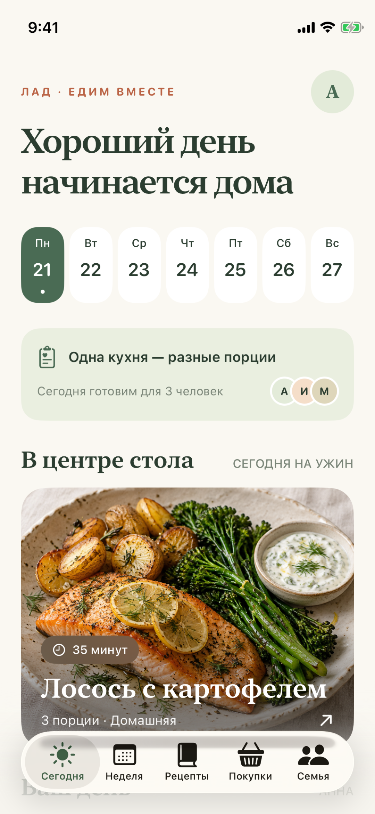
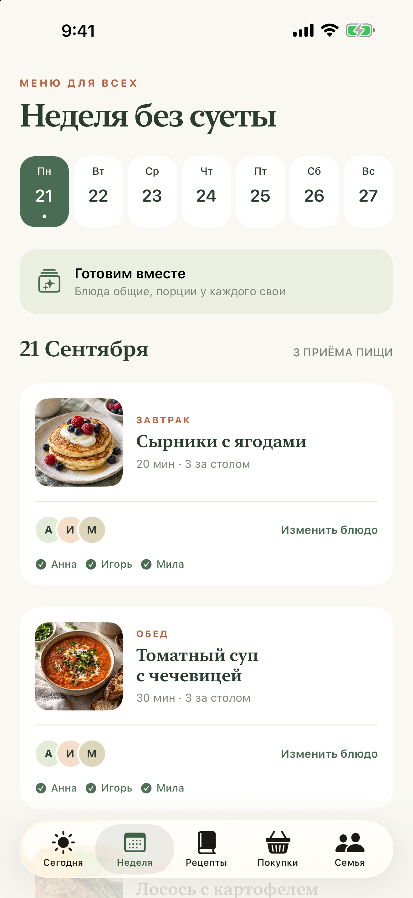
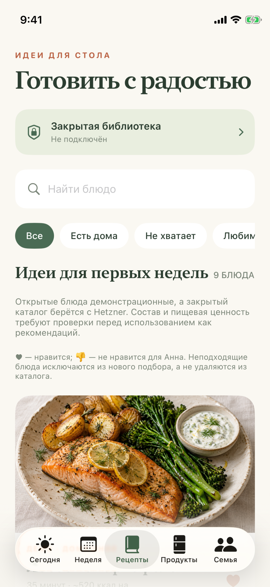
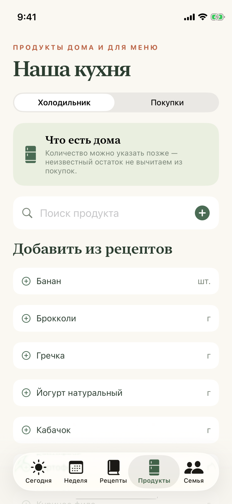
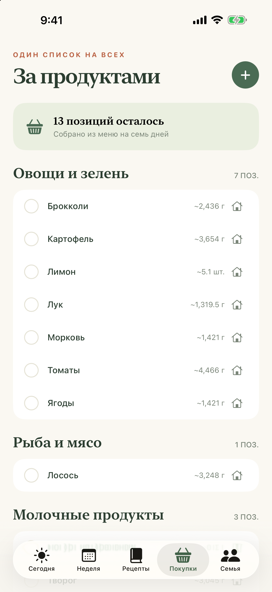
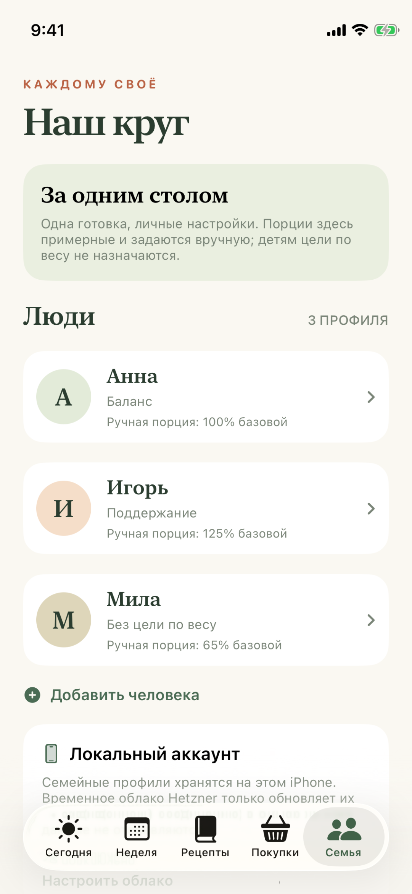

# Лад — одна кухня, разные порции

Нативный SwiftUI-прототип семейного планировщика питания для iPhone. Открытые демо-рецепты входят в приложение; закрытые должны загружаться по HTTPS с отдельного сервера после авторизации. Исходники доступны публично, но **не распространяются по open-source лицензии** — см. [LICENSE](LICENSE).



| [Неделя](docs/screenshots/02-week.png) | [Рецепты](docs/screenshots/03-recipes.png) | [Холодильник](docs/screenshots/06-pantry.png) | [Покупки](docs/screenshots/04-shopping.png) | [Семья](docs/screenshots/05-family.png) |
| --- | --- | --- | --- | --- |
|  |  |  |  |  |

В прототипе работают семь дней меню с разными блюдами по дням, участники каждого приёма пищи, индивидуальные ручные порции, отметки съеденного отдельно от плана, девять **демонстрационных** открытых рецептов с шагами готовки, личное избранное, отметка «не нравится» для каждого человека и простой личный учёт добавок. «Не нравится» исключает блюдо из нового подбора для общей готовки, если его отметил хотя бы один участник. «Сегодня не хочу» предлагает другую совместимую замену для конкретного приёма пищи; меню и покупки меняются только после подтверждения, последнее изменение можно отменить. Раздел «Продукты» хранит известные или неизвестные количества и сроки годности, предлагает все уникальные ингредиенты загруженных рецептов с автоподгрузкой при прокрутке, поиск по синонимам («помидор» находит «Томаты») и ручное добавление. Каталог рецептов также подгружается на экран порциями из уже загруженных данных. Синонимы учитываются в запасах и покупках при совпадении единиц измерения. Покупки показывают потребность меню за вычетом известного запаса и происхождение каждой позиции. Подбор показывает недостающие ингредиенты; отметка «Закончилось» предлагает изменения будущего меню с подтверждением и отменой. Семейные профили и неделя хранятся в локальном аккаунте на iPhone; имена и возраст пилотной семьи можно обновить с защищённого сервера Hetzner. Личные настройки порций, калорийного ориентира, ограничений и вкусов остаются локальными.

## Запуск

Откройте `Lad.xcodeproj` в Xcode, выберите схему `Lad` и iPhone Simulator, затем Run. Для физического iPhone требуется собственная команда разработчика и активный профиль подписи в Xcode. Исходный `project.yml` можно пересоздать через `xcodegen generate`; проект Xcode также сохранён в репозитории.

Для проверки в терминале:

```sh
xcodebuild -project Lad.xcodeproj -scheme Lad -configuration Debug -destination 'generic/platform=iOS Simulator' CODE_SIGNING_ALLOWED=NO build
xcodebuild -project Lad.xcodeproj -scheme Lad -destination 'platform=iOS Simulator,name=iPhone 13 mini' CODE_SIGNING_ALLOWED=NO test
python3 -m unittest discover -s api -p 'test_*.py' -v
```

## Закрытая библиотека

Кнопка «Закрытая библиотека» на экране рецептов принимает HTTPS-адрес и личный ключ. Ключ хранится в iOS Keychain; запрос идёт с `Authorization: Bearer`, без обычного URL-кэша. Если каталог отключён, запланированный закрытый рецепт **не подменяется** похожим открытым: приложение явно показывает недоступность и предупреждает о неполном списке покупок.

В [`api/`](api/README.md) лежат пилотный сервер и формат данных. На Hetzner он запущен за отдельным HTTPS-входом по IP, с автоматическим обновлением короткоживущего сертификата; процесс слушает только loopback. Доступ защищён ключом в Keychain. В закрытом каталоге есть **13 редакционных черновиков по присланным фотографиям**. Исходные фото хранятся в закрытом архиве, вне GitHub и не раздаются приложением. Для каждого черновика создано самостоятельное изображение блюда; оно отдаётся только по авторизованному HTTPS-запросу. Проверенный по формату ответ временно сохраняется в защищённой папке приложения на iPhone, чтобы ингредиенты не пропадали при кратком сбое связи; отключение каталога удаляет кэш. Черновики показывают составы и заново написанные инструкции, но не участвуют в планировании, пока не проверены аллергены, граммовки и выход порций. Неизвестная калорийность не подменяется нулём. Девять открытых блюд в сборке — временные демо, не рецепты пользователя. Семейные данные, закрытые рецепты, токены, `.env` и профили подписи в GitHub не размещаются. Начальная модель с одним ключом подходит лишь для небольшого пилота, не для продажи доступа.

## Границы и план

[Сверка с брифом v3.0 по U01–U36](docs/PLAN_REVIEW.md) показывает, что есть сейчас и что ещё не реализовано. Это не готовый App Store-релиз: цифры питания, состав и технология девяти демо-рецептов не валидированы; детские, медицинские и аллергенные сценарии требуют профессиональной проверки. Калорийность служит только приблизительным сравнением; жиры, углеводы и микронутриенты без источника отображаются как неизвестные, а не нулевые. Никаких рекомендаций по снижению веса или приёму БАДов приложение не выдаёт.

Фотографии блюд и иконка созданы для проекта встроенным генератором изображений. Все девять снимков открытых демо-блюд и иконка входят в репозиторий; [запросы для шести новых снимков](docs/IMAGEGEN.md) сохранены отдельно. 13 изображений закрытых рецептов лежат в исключённой из Git папке `private-assets/` и на защищённом сервере. Переписывание текста и новая иллюстрация сами по себе не подтверждают права на публикацию исходного рецепта: перед коммерческим релизом нужен отдельный правовой и редакционный аудит.
